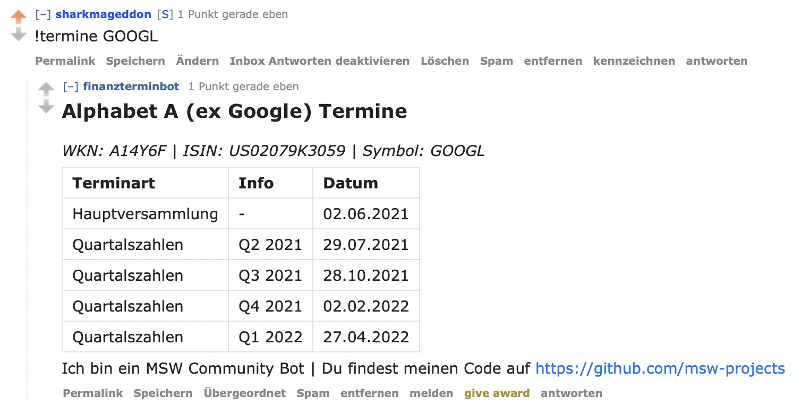

# MSW Finanzterminbot

Antwortet auf Befehle im Subreddit mit wichtigen Unternehmensterminen

---

## Bot Commands

Der Bot kann in einem Reddit-Kommentar über den Befehl `!termine <STOCK>` getriggert werden (`!termin <STOCK>` ist auch möglich).

Unterstützt werden:
- WKN: `!termine BAY001`
- ISIN: `!termine DE0006459324`
- Symbol: `!termine AAPL` oder `!termine $AAPL` (nur für amerikanischen Aktien, deutsche Symbole funktionieren nicht zuverlässig)

[!] Die Datenquelle ist nocht nicht perfekt. Für LuS haben wir bspw. keine Daten.

## Setup

- Virtual environment anlegen: `python -m venv env`
- Virtual environment aktivieren: `source env/bin/activate`
- Dependencies installieren: `python -m pip install -f requirements.txt`
- Konfigurationsvorlage `.env.template` in neue Datei `.env` kopieren und anpassen. 
  (Bitte nicht die `.env.template` direkt anpassen, da sonst ausversehen API Keys ins Repo gepusht werden könnten!)

## Usage

Der Bot wird über `finanzterminbot.py` gestartet: `python finanzterminbot.py`

Mehr Infos: `python finanzterminbot.py --help`

## TODO

- Containerisierung?
- Systemd o.Ä. Skript
- Robusteres Error Handling